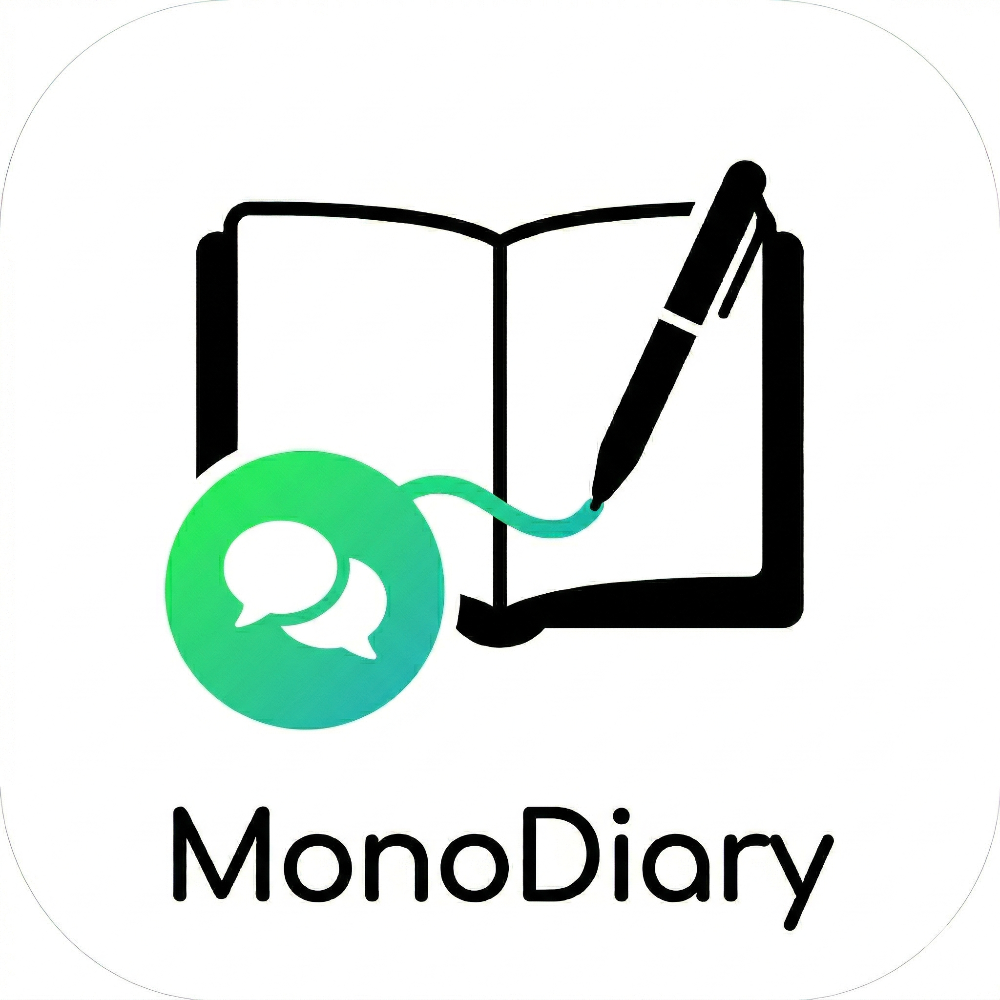
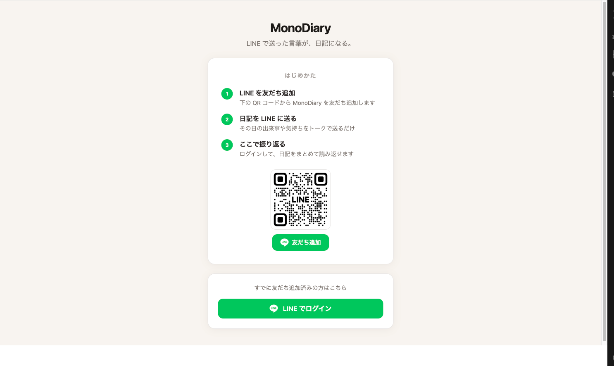
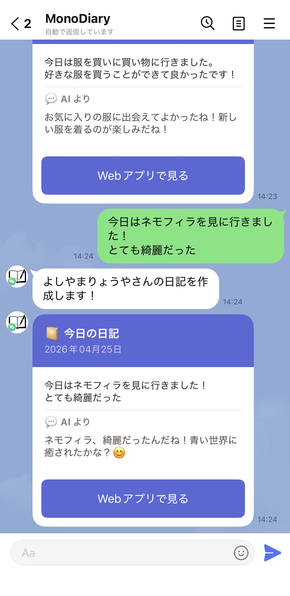
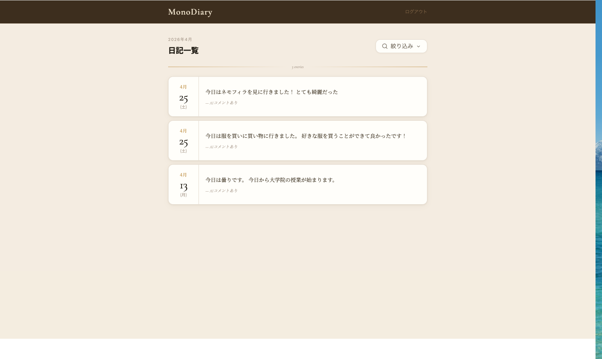
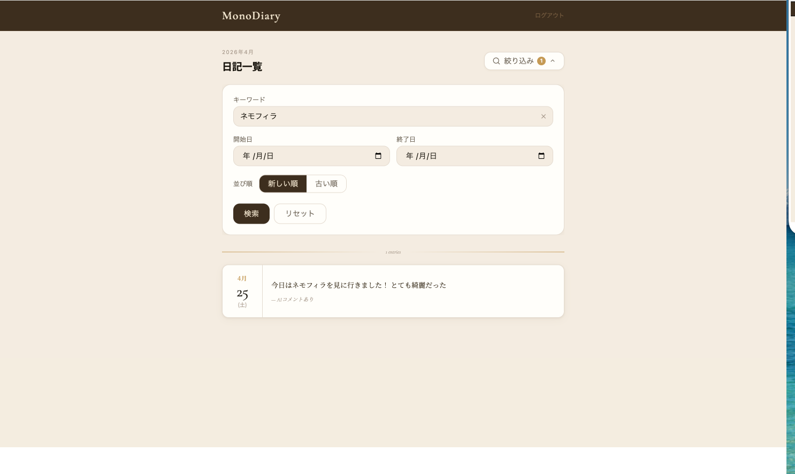
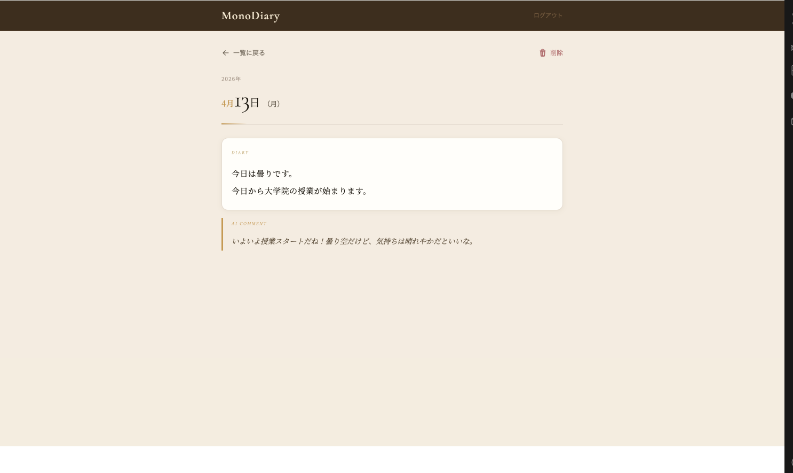
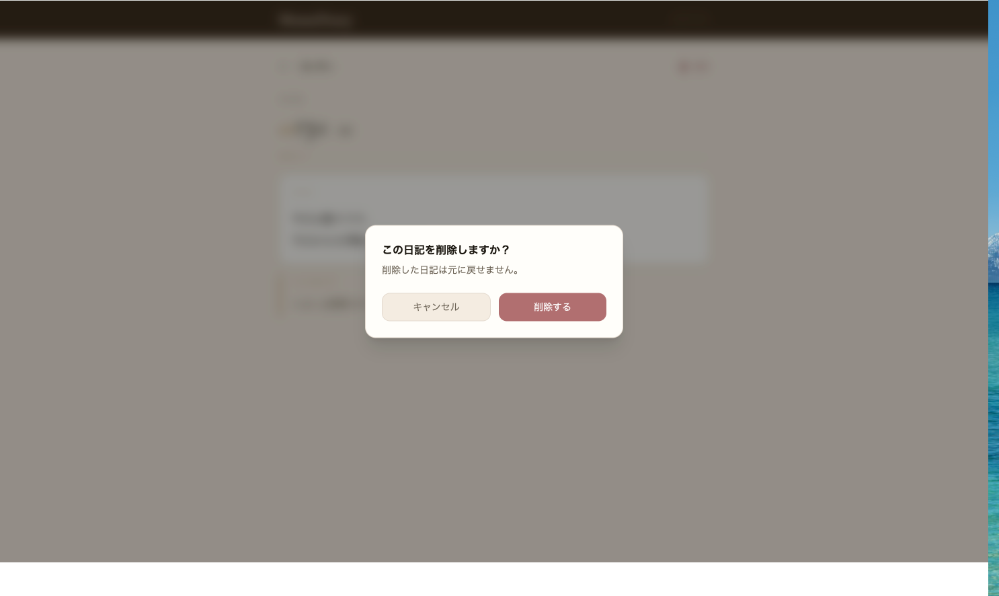

# MonoDiary

  

LINE で送った言葉が、日記になる。

## MonoDiary とは

LINE に送ったテキストメッセージをそのまま記録し、AI が一言コメントを添えて保存するアプリです。

「今日こんなことがあった」と LINE に送るだけで、書いた言葉がそのまま日記として残り、Gemini が温かみのある一言コメントを付けてくれます。Web アプリ側では一覧・検索・詳細表示で過去の記録を振り返ることができます。

## 技術スタック

| レイヤー | 技術 |
|---|---|
| フロントエンド | React / TypeScript / Vite / Tailwind CSS |
| バックエンド | Go / Echo  |
| データベース | PostgreSQL  |
| AI | Google Gemini API（gemini-2.5-flash） |
| 外部連携 | LINE Messaging API / LINE Login |
| インフラ | Docker |

## 機能紹介

### はじめかた / ログイン

QR コードから MonoDiary を LINE 友だち追加し、LINE でログインするだけで使い始められます。

  

---

### LINE で日記を記録する

LINE のトークに今日の出来事を送ると、Gemini が日記文を生成してすぐに返信します。返信には「Web アプリで見る」ボタンが付いており、詳細画面へそのまま遷移できます。

  

---

### 日記一覧

ログイン後の Web アプリでは、日付ごとに日記が一覧表示されます。各エントリには AI コメントの有無も表示されます。

  

---

### 検索・絞り込み

キーワード・期間・並び順で日記を絞り込めます。過去のエピソードを素早く見つけ直すことができます。

  

---

### 日記詳細

日記の詳細画面では、Gemini が生成した本文と AI コメントをあわせて確認できます。

  

---

### 日記の削除

不要な日記は詳細画面から削除できます。誤操作防止のため、削除前に確認ダイアログが表示されます。

  

---

## 動作確認について

現在は公開デプロイを行っていないため、実際の動作確認はできません。
スクリーンショットと上記の機能紹介をご参照ください。

## 設計後に追加・変更した機能

要件定義・詳細設計の策定後、実装を進める中で以下の変更・追加を行いました。

| 変更点 | 設計時の方針 | 実装での変更内容 |
|--------|-------------|----------------|
| 検索・絞り込み | 要件定義（F-06）では「プロトタイプでは省略可」と記載 | キーワード検索・日付範囲・並び順の絞り込みを実装。振り返りのしやすさを優先して判断 |
| エントリ削除 | 設計書に記載なし | 詳細画面から日記を削除できる機能を追加。誤送信などへの対応として必要と判断 |
| AI 生成失敗時の挙動 | 設計では「空文字でフォールバック保存」 | エラーを返してエントリを保存しない方式に変更。不完全な状態で記録が残ることを避けるため |

## 今後改善予定の機能

| 機能 | 概要 |
|---|---|
| 画像の取り込み | 写真付きでエントリを残せるようにし、マルチモーダルで日記を生成する |
| 生成結果のリトライ・修正 | 気に入らない場合に数回限り再生成や修正依頼ができるようにする |
| AI コメントの文脈連携 | 過去の日記を参照した上で AI コメントを生成し、「昨日は大変だったけど、今日はいいことがあって良かったね」のように日々の流れを踏まえた返答ができるようにする |
