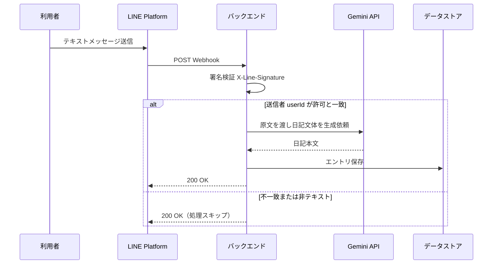
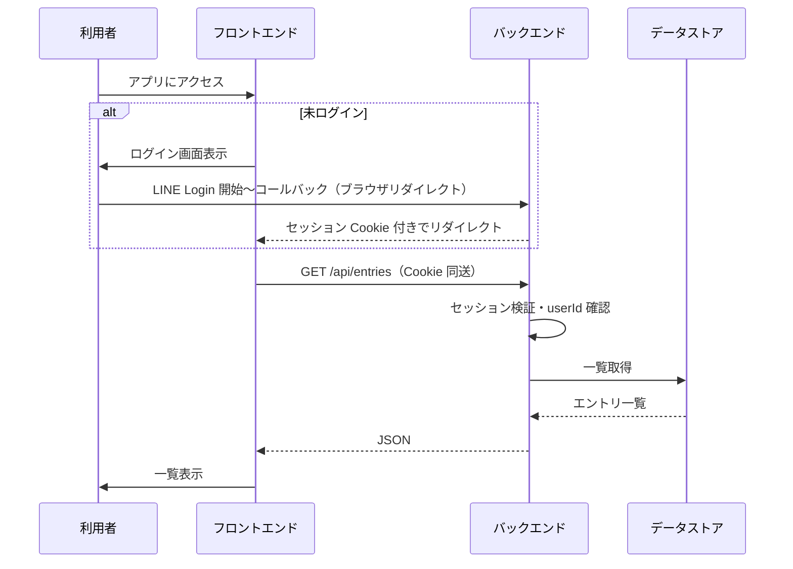

# MonoDiary 基本設計書

| 項目 | 内容 |
|------|------|
| 文書名 | MonoDiary 基本設計書 |
| ファイル | `docs/basic-design.md` |
| プロジェクト名 | MonoDiary |
| 版 | 0.4 |
| 最終更新日 | 2026-04-04 |
| 参照 | [`docs/requirements.md`](requirements.md)（要件定義書 v0.4） |

---

## 1. 本書の目的と位置づけ

本書は要件定義に基づき、MonoDiary の**システム構成**、**主要な処理の流れ**、**データと API の骨子**、**認証の方針**を定める。実装時の詳細（リクエスト／レスポンスのフィールド単位、プロンプト全文、マイグレーション手順など）は**詳細設計・実装**に委ねる。

---

## 2. システム全体構成

### 2.1 全体構成図

```
┌─────────────────────────────────────────────────────────────────────────────┐
│  クライアント層（利用者）                                                      │
│  ┌──────────────────────────────┐  ┌──────────────────────────────────────┐ │
│  │  LINE アプリ                  │  │  Web ブラウザ                         │ │
│  │  - テキスト送信 → Messaging  │  │  React（TypeScript / Tailwind）       │ │
│  └──────────────────────────────┘  │  │  - ログイン / 一覧・詳細（§8）        │ │
│                                     └──────────────────────────────────────┘ │
└─────────────────────────────────────────────────────────────────────────────┘
        │ Webhook                         │ HTTPS / JSON・Cookie（セッション）
        ▼                                 ▼
┌─────────────────────────────────────────────────────────────────────────────┐
│  アプリケーション層（MonoDiary）                                              │
│  ┌───────────────────────────────────────────────────────────────────────┐ │
│  │  Go / Echo（Render 等）                                                 │ │
│  │  - REST `/api/*`・LINE Login コールバック・Messaging Webhook             │ │
│  │  - 本人判定・ユースケース（内部構成は §2.2）・§7 のパッケージ案に対応     │ │
│  └───────────────────────────────────────────────────────────────────────┘ │
└─────────────────────────────────────────────────────────────────────────────┘
                                      │
              ┌───────────────────────┼───────────────────────┐
              ▼                       ▼                       ▼
┌─────────────────────────┐ ┌─────────────────────────┐ ┌─────────────────────────┐
│  LINE Platform          │ │  Google                 │ │  永続化                  │
│  - Messaging API        │ │  - Gemini API           │ │  - PostgreSQL            │
│  - LINE Login（OAuth）   │ │                         │ │    （Supabase 等）        │
└─────────────────────────┘ └─────────────────────────┘ └─────────────────────────┘
```

ブラウザはログイン時に LINE Login とリダイレクトで往復する。LINE 経路は Webhook でバックエンドへ入る。データは **PostgreSQL** に保存する。

### 2.2 クリーンアーキテクチャ（バックエンド）

バックエンドはクリーンアーキテクチャに準拠し、**依存関係の向きは内側（Domain）に向かう**（要件 NF-04）。ORM・外部 SDK はインフラに閉じ、`domain` は他パッケージを import しない。

```
                    ┌─────────────────────────────────────────┐
                    │  Interfaces（アダプタ層）               │
                    │  adapter/http/  adapter/line/  auth/    │
                    └────────────────────┬────────────────────┘
                                         │ 依存
                                         ▼
┌────────────────────────────────────────────────────────────────────────────┐
│  Application（ユースケース層）                                              │
│  usecase/  日記エントリ作成・一覧取得 等                                     │
│  ポート    EntryRepository, DiaryGenerator, Session 等（interface）          │
└────────────────────────────────────┬───────────────────────────────────────┘
                                     │ 依存
                                     ▼
┌────────────────────────────────────────────────────────────────────────────┐
│  Domain（ドメイン層）                                                        │
│  entities/  DiaryEntry 等                                                   │
│  ※ フレームワーク・DB・外部 SDK への依存なし                                  │
└────────────────────────────────────────────────────────────────────────────┘
                                     ▲
                                     │ 実装（implements）
┌────────────────────────────────────┴───────────────────────────────────────┐
│  Infrastructure（インフラ層）                                                │
│  persistence/  PostgreSQL         │  gemini/  │  session/（詳細は詳細設計）   │
└────────────────────────────────────────────────────────────────────────────┘
```

---

## 3. 利用者識別とアクセス制御（要件 F-11 の方針）

要件定義では「単一利用者（本人のみ）」とあるため、基本設計では次の方針とする。

### 3.1 LINE userId の一意性

- **Messaging API** のイベントにおける送信者識別子（`source.userId`）と、**LINE Login** で取得できる同一アカウントのユーザー ID（プロフィール API 等で得る `userId`）は、同一人物であれば**同じ値**になる前提とする（LINE の仕様に準拠）。

### 3.2 本人のみの実現方法（推奨）

| 項目 | 内容 |
|------|------|
| 設定 | 環境変数（例: `MONODIARY_ALLOWED_LINE_USER_ID`）に**本人の userId を1件**登録する |
| Webhook | 受信イベントの送信者 `userId` が上記と**一致する場合のみ**エントリ保存・Gemini 呼び出しを行う。一致しない場合は**200 を返しつつ処理しない**（または仕様でログのみ） |
| Web API | セッションに紐づく `userId` が上記と**一致する場合のみ**一覧・詳細を返す。LINE Login 完了時にプロフィールから `userId` を取得し検証する |

将来マルチユーザーに拡張する場合は、許可リストを DB 化する想定でよい。

### 3.3 認証フロー（概要）

**バックエンド主導の認可コードフロー**を採用する（クライアントシークレットをブラウザに載せない）。

1. 利用者がフロントのログイン画面から「LINE でログイン」を押す  
2. フロントはバックエンドの **ログイン開始 URL**（例: `GET /auth/line`）へ遷移、またはバックエンドが LINE 認可 URL へ **302**  
3. 利用者が LINE で同意後、**コールバック URL はバックエンド**（例: `GET /auth/line/callback`）が受け取る  
4. バックエンドが認可コードを **トークンエンドポイント**で交換し、**ID トークン検証**および **プロフィール取得**で `userId` を得る  
5. `userId` が `MONODIARY_ALLOWED_LINE_USER_ID` と一致すれば **セッションを発行**（HttpOnly, Secure, SameSite を適切に設定した Cookie 等）  
6. フロントをアプリのトップ（一覧）へリダイレクト  

**ログアウト**: セッション無効化エンドポイント（例: `POST /auth/logout`）と Cookie 削除。

詳細（セッションストアを DB に置くか、署名付き Cookie のみか）は詳細設計で確定する（要件 10 の未決定 5 に対応）。

---

## 4. 主要ユースケースと処理フロー

### 4.1 LINE から日記が1件追加されるまで



- **テキスト以外**のイベントは要件 F-01 に従い処理しない（必要ならログのみ）。  
- **重複配送**対策: `message.id` を保存しユニーク制約または冪等チェック（詳細設計で確定）。

### 4.2 Web で一覧・詳細を見るまで



---

## 5. データ設計

### 5.1 論理エンティティ

| エンティティ | 説明 |
|--------------|------|
| **DiaryEntry（日記エントリ）** | 1 回の LINE テキストに対応。原文、日記文体本文、時刻、LINE 側メッセージ ID（重複対策用）等を持つ |

単一利用者のため、**ユーザー用テーブルは必須ではない**（`line_user_id` をエントリに持つ、または環境変数のみで固定）。

### 5.2 PostgreSQL（物理案）

テーブル名・カラム名は実装で調整可。詳細は [`docs/detailed-design.md`](detailed-design.md) 第 7 章。

| カラム | 型（案） | 説明 |
|--------|----------|------|
| `id` | UUID または BIGSERIAL | 主キー |
| `line_user_id` | VARCHAR | 送信者（本人） |
| `line_message_id` | VARCHAR, UNIQUE (NULL 可) | 重複防止。取得できない場合は NULL |
| `source_text` | TEXT | 原文 |
| `diary_text` | TEXT | 日記文体（LLM 出力） |
| `created_at` | TIMESTAMPTZ | 受信または保存基準時刻 |
| `updated_at` | TIMESTAMPTZ | 任意 |

インデックス: `created_at DESC`（一覧用）、`line_message_id`（ユニーク）。

---

## 6. API 基本設計（REST 案）

ベース URL は環境依存（例: `https://api.example.com`）。**すべて HTTPS**。

| メソッド | パス | 認証 | 概要 |
|----------|------|------|------|
| `POST` | `/webhooks/line` | LINE 署名（`X-Line-Signature`） | Messaging Webhook。本文は LINE 公式の JSON |
| `GET` | `/auth/line` | なし | LINE 認可画面へリダイレクト |
| `GET` | `/auth/line/callback` | なし（state で CSRF 対策） | 認可コード処理、セッション発行、フロントへリダイレクト |
| `POST` | `/auth/logout` | セッション | ログアウト |
| `GET` | `/api/entries` | セッション | 一覧。クエリ: `limit`, `cursor` または `page`（詳細設計で確定） |
| `GET` | `/api/entries/:id` | セッション | 詳細 |

**エラーハンドリング**: 4xx/5xx と JSON 形式のエラーボディ（詳細設計で形式統一）。

**CORS**: フロントと API が**別オリジン**の場合、`Access-Control-Allow-Credentials` とフロントオリジンの許可が必要。同一サイト配下にまとめる構成も選択肢。

---

## 7. バックエンド内部モジュール構成（案）

保守性（要件 NF-04）と 2.2 の層構造に対応するため、次の**パッケージ分割**を推奨する。`usecase` にポート（インタフェース）を置き、`infrastructure` が実装する形が読みやすい。

```
cmd/server/                 # エントリポイント・DI 組み立てのみ
internal/
  domain/                   # エンティティ・（必要なら）ドメインエラー。外部 import なし
  usecase/                  # ユースケース。ポート（Repository / DiaryGenerator / Session 等）をここで定義
  adapter/
    http/                   # Echo ハンドラ、リクエスト／レスポンス変換、ルーティング登録
    line/                   # Webhook 署名検証、イベント→ユースケース入力への変換
    auth/                   # LINE Login コールバック処理のうち「HTTP・外部 API 呼び出し」寄りの部品
  infrastructure/
    persistence/            # ポート実装: postgresql（テスト用にインメモリ等も可）
    gemini/                 # DiaryGenerator の実装
    session/                # セッション永続化（実装方針は詳細設計）
```

環境変数や DI で `persistence`・`gemini`・`session` の具体実装を差し替える。`adapter` は `usecase` のインタフェース越しに結果を返し、**ドメインオブジェクトを跨層でそのまま渡すか、adapter 近辺で DTO にするか**はチームで統一する（推奨: ユースケースの入出力はユースケース層の型に寄せる）。

---

## 8. フロントエンド画面構成（案）

| 画面 | 内容 |
|------|------|
| `/login` | 専用ログイン画面。「LINE でログイン」→ バックエンドの `/auth/line` へ |
| `/` または `/entries` | 認証必須。日記エントリ一覧 |
| `/entries/:id` | 認証必須。原文と日記本文の表示 |

未認証で保護ルートに入った場合は `/login` へリダイレクト。

---

## 9. 非機能要件への対応方針

| 要件 ID | 基本設計上の方針 |
|---------|------------------|
| NF-01 | Webhook 署名必須。LINE Login の state/nonce・ID トークン検証。シークレットは環境変数／ホストのシークレット機能。Cookie は HttpOnly + Secure（本番） |
| NF-02 | Render 無料 Web のスピンダウン等は許容。初回遅延は UI で考慮 |
| NF-03 | Webhook 内で Gemini 同期呼び出しでよい。タイムアウト・リトライは詳細設計 |
| NF-04 | 上記ディレクトリ構成・クリーンアーキテクチャによる層分離とポート／アダプタ |
| NF-05 | PostgreSQL（Supabase 等）とホスティングを無料枠優先で選定。有料化は明示的に判断する |

---

## 10. ローカル開発（Docker）方針

| サービス | 内容 |
|----------|------|
| API | `docker compose` で Go サーバーを起動（ホットリロードは任意） |
| フロント | 同一 Compose またはホストで `npm run dev`（チーム方針で統一） |
| DB | **PostgreSQL コンテナ**（本番に近い `DATABASE_URL`） |
| LINE / Gemini | 実 API を使うか、モックハンドラを切替（環境変数） |

**Webhook / OAuth コールバック**はローカルでは **ngrok 等のトンネル**が必要になる想定を明記する。

---

## 11. デプロイ時の環境変数（例・非網羅）

| 変数名（例） | 用途 |
|--------------|------|
| `MONODIARY_ALLOWED_LINE_USER_ID` | 本人の LINE userId |
| `LINE_CHANNEL_SECRET` | Messaging API 署名 |
| `LINE_CHANNEL_ACCESS_TOKEN` | 返信等が必要になった場合（初版は任意） |
| `LINE_LOGIN_CHANNEL_ID` / `LINE_LOGIN_CHANNEL_SECRET` | LINE Login |
| `LINE_LOGIN_CALLBACK_URL` | コールバック URL（HTTPS） |
| `GEMINI_API_KEY` | Gemini |
| `DATABASE_URL` | PostgreSQL |
| `SESSION_SECRET` | セッション署名または暗号化 |

---

## 12. 詳細設計・実装に委ねる事項

- OpenAPI 3.0 等による **API 詳細仕様**  
- **プロンプト**全文とモデル名、トークン上限、失敗時のフォールバック（原文のみ保存等）  
- **セッション実装**（DB / Redis / 署名 Cookie）と有効期限  
- **マイグレーション**ツールの選定と運用  
- **E2E テスト**とシードデータ  

---

## 改訂履歴

| 版 | 日付 | 内容 |
|----|------|------|
| 0.1 | 2026-04-02 | 初版（`requirements.md` v0.3 に基づく） |
| 0.2 | 2026-04-03 | 論理構成図の再構成（MonoDiary 境界・経路表の追加）。バックエンドをクリーンアーキテクチャ前提で整理しセクション 7 を整合 |
| 0.3 | 2026-04-03 | §2 を短縮。全体構成・バックエンド層を ASCII 図に統一（Mermaid・長文の原則説明・コンポーネント表を整理） |
| 0.4 | 2026-04-04 | 永続化を PostgreSQL のみに統一（要件 v0.4 に整合）。Sheets・フェーズ A/B を削除 |
